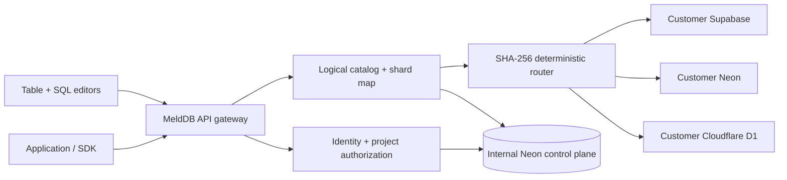

# MeldDB

MeldDB is a control plane and routing layer for databases a customer already owns. It provides one logical catalog, API, SDK, table editor, SQL experience, infrastructure view, and developer-context surface across Supabase, Neon, and Cloudflare D1.

> You own the databases. MeldDB connects them.

Customer application rows stay in provider databases. MeldDB's internal Neon database holds lightweight control-plane metadata: identities, sessions, memberships, encrypted provider credentials, logical schemas, physical placements, key verifiers, aggregated usage, audit events, and short-lived query metadata.

## Architecture



The V1 distributed layer deliberately supports a narrow, correct model: one logical table per Unified SQL statement, explicit shard placement, deterministic routing for writes, and fan-out reads. It rejects cross-provider joins and other unsupported shapes instead of returning misleading results. Full PostgreSQL or SQLite SQL is available by choosing a physical node.

## Product surface

- Email/password authentication with Better Auth and secure sessions
- Workspaces, projects, role-aware membership, and tenant isolation
- Supabase OAuth with PKCE, project management, Auth configuration, and Edge Functions
- Neon API-key validation, project creation/attachment, and encrypted project connection URIs
- Cloudflare OAuth, explicit account selection, and D1 management/query access
- Provider-aware quota states and saga-style independent provisioning
- Logical schema, explicit physical shards, table creation, paginated row CRUD
- Lazy-loaded Monaco SQL and function editors
- HMAC-verified `mdb_live_…` keys, REST gateway, and typed SDK package
- Bounded query metadata, aggregate usage buckets, audit records, and retention pruning
- Responsive marketing, docs, security, onboarding, and product interfaces

## Local development

Requirements: Node.js 22.12+, npm 10+, and a PostgreSQL-compatible Neon database.

```bash
npm ci
cp .env.example .env.local
# fill the required variables below
npm run db:migrate
npm run dev
```

Open [http://localhost:3000](http://localhost:3000). Never commit `.env.local`; all `.env*` files except `.env.example` are ignored.

### Required environment variables

For the simplest Vercel deployment, only two secrets are required:

| Variable | Purpose |
| --- | --- |
| `DATABASE_URL` | Pooled Neon connection for MeldDB's internal control plane |
| `CREDENTIAL_ENCRYPTION_KEY` | Exactly 32 random bytes, typically a 64-character hex value, for AES-256-GCM credential encryption |

`CREDENTIAL_ENCRYPTION_KEY_VERSION` defaults to `1`. `BETTER_AUTH_SECRET` is optional; when omitted, MeldDB deterministically derives a separate auth-signing secret from the credential key. On Vercel, `APP_URL` and `BETTER_AUTH_URL` are inferred from Vercel system URLs.

Supabase and Cloudflare owner OAuth variables remain optional until those integrations are activated. Their callback URLs are inferred automatically on Vercel unless explicitly overridden. Neon keys are supplied by each user through MeldDB and encrypted in the control plane.

See [docs/development.md](docs/development.md), [docs/deployment.md](docs/deployment.md), and [.env.example](.env.example).

## Database and maintenance

```bash
npm run db:generate   # generate migrations after schema changes
npm run db:migrate    # apply committed migrations
npm run db:studio     # local Drizzle Studio
npm run db:prune      # delete expired sessions/OAuth/query metadata and aged audits
```

Run `db:prune` on a daily protected schedule in production. Migrations are committed under `drizzle/` and must run before deploying application code that depends on them.

## Verification

```bash
npm run lint
npm run typecheck
npm test
npm run build
npm run test:e2e
```

`npm run check` runs lint, typecheck, unit/integration tests, and the production build. Provider tests use safe mocked HTTP responses when external credentials are unavailable. GitHub Actions runs static/unit/build gates and public responsive Playwright tests without exposing deployment secrets to pull requests.

## API and SDK

```ts
import { createMeldDB } from "@melddb/sdk";

const db = createMeldDB({
  apiKey: process.env.MELDDB_API_KEY!,
  projectId: process.env.MELDDB_PROJECT_ID!,
  baseUrl: "https://your-melddb.example",
});

const result = await db
  .from("users")
  .select("id,email,status")
  .eq("status", "active")
  .order("email")
  .limit(20)
  .execute();
```

Keys are server credentials. Do not expose them through `NEXT_PUBLIC_*`, browser bundles, screenshots, or logs.

## Security and limitations

- Provider credentials use authenticated AES-256-GCM encryption with per-record nonces and versioned keys.
- MeldDB API keys are never stored raw; only a prefix and HMAC-SHA-256 verifier are persisted.
- Every server-side project operation rechecks authenticated membership and minimum role.
- SQL classification uses a parser/AST. User values are parameters; catalog identifiers are validated and quoted.
- Query results are ephemeral and capped at 1,000 rows.
- D1 remains SQLite; Supabase and Neon remain PostgreSQL. Quotas, compute, requests, and egress are not interchangeable.
- V1 does not support cross-provider joins, distributed transactions, or automatic live rebalancing.
- Deleting a MeldDB project must preserve provider infrastructure by default.

See [docs/security.md](docs/security.md) and [docs/unified-sql.md](docs/unified-sql.md). MeldDB makes no compliance-certification claims.

## Deployment

Vercel is the easiest path. The repository includes `vercel.json`, which applies committed Drizzle migrations automatically before the production build. Import the GitHub repository into Vercel and add only `DATABASE_URL` and `CREDENTIAL_ENCRYPTION_KEY` to get the core MeldDB app online. Vercel system URLs configure the production auth origin automatically.

Supabase and Cloudflare OAuth client credentials can be added later. `/api/health` checks only control-plane reachability and returns no sensitive details.

Detailed steps: [docs/deployment.md](docs/deployment.md).

## Repository guides

- [Architecture](docs/architecture.md)
- [Security](docs/security.md)
- [Providers](docs/providers.md)
- [Unified SQL](docs/unified-sql.md)
- [Development](docs/development.md)
- [Deployment](docs/deployment.md)
- [Research and design rationale](docs/research-and-design.md)

## License

No license has been granted yet. Add an explicit license before accepting external redistribution or contributions.
