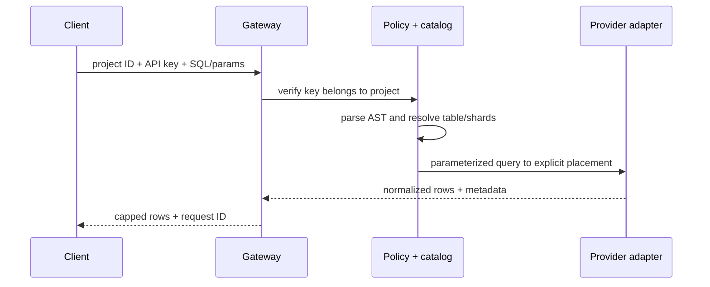

# Architecture

MeldDB separates the control plane from the customer-owned data plane.

## Control plane

The internal Neon database stores authentication records, workspaces and project membership, provider connection state, encrypted credential envelopes, logical catalog entries, physical placement metadata, API-key verifiers, aggregate usage, audit events, bounded query metadata, and caches of safe provider metadata. It does not store customer query results.

The Next.js application is both the web product and API gateway. Server Components read project state. Route handlers re-authorize every mutation and never trust a browser-supplied project ID without membership resolution.

## Data plane

Each provider implements `DatabaseProviderAdapter`, including capability declaration, resource lifecycle, capacity, storage, schema, query, table DDL, and health operations. Supabase and Neon are PostgreSQL. D1 is SQLite. Capability differences remain explicit.

## Provisioning

External provider operations cannot share an ACID transaction. A `provisioning_operations` record tracks saga state and completed steps. Success on one provider is retained if another provider fails. Quota exhaustion is a normal per-provider state and never invalidates the MeldDB project.

## Routing

Physical shards and placements are explicit. `sha256_u64_mod_v1` canonicalizes the routing key, hashes it with SHA-256, reads a fixed unsigned 64-bit prefix, and selects an ordered shard. This definition is stable across runtimes; JavaScript object hashing is never used.

V1 writes to multi-shard tables require an explicit routing key. Reads without a routing key fan out to active primary placements and merge capped results. No automatic online rebalance occurs.

## Retention

Hourly and daily tables aggregate usage. Recent query records have per-row expiry. OAuth state and sessions expire. `npm run db:prune` removes expired transient records and audits older than configured retention.
